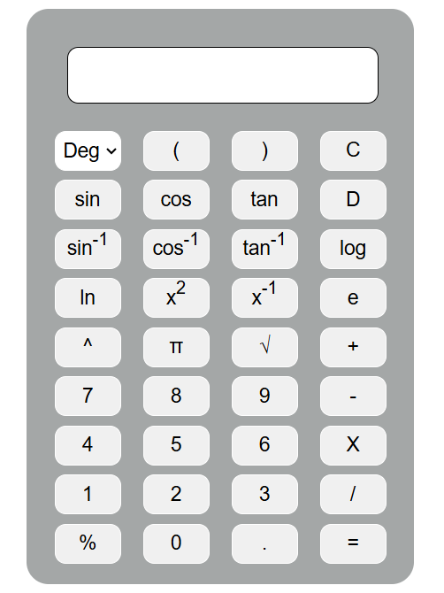

# 🧮 Scientific Calculator

A responsive and functional *Scientific Calculator* built using *HTML*, *CSS*, and *JavaScript*. This calculator supports both *Degree* and *Radian* modes and includes essential and advanced mathematical functions like trigonometry, logarithmic operations, powers, square roots, and inverse trigonometric functions.

---

## 📁 Project Structure

Scientific-Calculator/ 
├── index.html
├── style.css
├── script.js 
├── README.md
└── LICENSE 

---

## 🌟 Features

- ✅ *Basic Arithmetic*: +, -, ×, /, %
- ✅ *Trigonometric Functions*: sin, cos, tan (supports both Degree and Radian modes)
- ✅ *Inverse Trigonometric Functions*: sin⁻¹, cos⁻¹, tan⁻¹
- ✅ *Logarithmic Functions*: log, ln
- ✅ *Exponential Functions*: e, x², x⁻¹, x^y
- ✅ *Constants*: π, e
- ✅ *Square Root*: √
- ✅ *Clear & Delete Functionality*
- ✅ *Mobile Responsive Design*

---

## 🎯 How to Use

1. *Clone the repository* or [Download ZIP](https://github.com/PL-MUTHUKUMARAN/Scientific-Calculator/archive/refs/heads/main.zip).
2. Open index.html in any web browser.
3. Choose either Degree or Radian mode from the dropdown.
4. Click buttons to build and evaluate expressions.

---

## 🧠 Behind the Scenes

- *Trigonometric calculations* are automatically converted to radians if Degree mode is selected.
- Custom JavaScript functions handle parsing and evaluating complex expressions.
- Uses the built-in Math object for precise calculations.
- Includes UI adjustments for small screen sizes using CSS media queries.

---

## 📸 Preview

---

## 🛠 Technologies Used

- HTML5
- CSS3 (with responsive layout)
- JavaScript (Vanilla JS, no frameworks)

---

## 📌 Future Improvements

- Keyboard input support
- Bracket balancing and auto-closing
- Improved expression parser
- Scientific notation support

---

## 📄 License

This project is open-source and available under the [MIT License](LICENSE).

---

## 🙋‍♂ Author

*Muthu Kumaran P*  
💼 Passionate about web development and electronics.  
🔗 [LinkedIn](https://www.linkedin.com/in/plmuthukumaran)  [GitHub](https://github.com/PL-MUTHUKUMARAN)

---